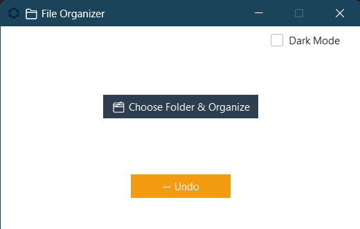

# 📁 File Organizer

A simple, clean, and powerful **File Organizer** desktop application built with **Python** and **ttkbootstrap** (a modern theme for Tkinter). This tool helps you instantly declutter your folders by sorting files into categories like Images, Videos, Documents, and more.

---

## 🚀 Features

✅ One-click folder organization  
✅ Drag-and-drop style GUI (future upgrade idea)  
✅ Undo last organization action  
✅ File type summary after organizing  
✅ Animated status and clean progress display  
✅ Theme toggle (Light/Dark)  
✅ Custom app icon  
✅ Standalone `.exe` for Windows — no Python required!  

---

## 🖼️ Preview



---

## 📦 Categories Handled

| Category    | Extensions                                                                 |
|-------------|----------------------------------------------------------------------------|
| 📷 Images    | `.jpg`, `.jpeg`, `.png`, `.gif`, `.bmp`                                   |
| 🎬 Videos    | `.mp4`, `.mkv`, `.flv`, `.avi`, `.mov`                                     |
| 📄 Documents | `.pdf`, `.docx`, `.doc`, `.txt`, `.xls`, `.xlsx`, `.pptx`                  |
| 🎵 Music     | `.mp3`, `.wav`, `.aac`, `.flac`                                            |
| 📦 Archives  | `.zip`, `.rar`, `.tar`, `.gz`                                              |
| 💻 Scripts   | `.py`, `.js`, `.html`, `.css`, `.php`, `.java`                            |
| ❓ Others     | Any files not matching the above extensions                               |

---

## 🛠 How It Works

1. Click "🗂 Choose Folder & Organize"
2. Select the folder you want to organize
3. Files are sorted into subfolders by type
4. View a summary of file counts
5. Need to undo? Hit the "↩ Undo" button

> All actions are logged to `log.txt` for undo tracking.

---

## 📥 Download

🔽 You can download the latest Windows installer from the [Releases page](https://github.com/Aqueel-i/file-organizer/releases).

> No Python installation is needed — just download and run the `.exe`.

---

## 🐍 Built With

- [Python 3.x](https://www.python.org/)
- [Tkinter](https://docs.python.org/3/library/tkinter.html) – GUI library
- [ttkbootstrap](https://ttkbootstrap.readthedocs.io/en/latest/) – Beautiful themes for Tkinter
- [PyInstaller](https://www.pyinstaller.org/) – Convert to `.exe`
- [NSIS](https://nsis.sourceforge.io/) – Windows installer creation

---

## 🧠 Future Ideas

- Drag & Drop folder selection  
- File preview panel  
- Settings window (choose categories or exclude folders)  
- Auto organize on folder changes (using watchdog)  
- Export summary report to file

---

## 🧾 License

This project is open source and free to use. License: [MIT](LICENSE)

---

## 🤝 Contributing

Pull requests, suggestions, and feedback are welcome!  
Feel free to fork this repo and enhance it.

---

## 🙋 FAQ

### ❓ I don't see my new icon after creating the `.exe`
Make sure to pass the `.ico` file explicitly when building:
```bash
pyinstaller --onefile --windowed --icon=icon.ico organizer.py
